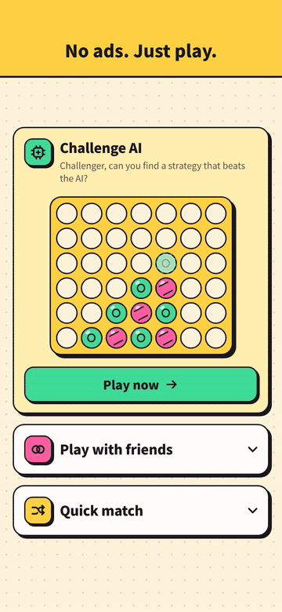
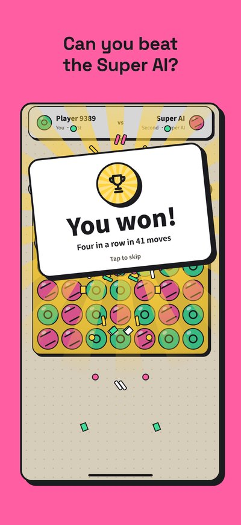
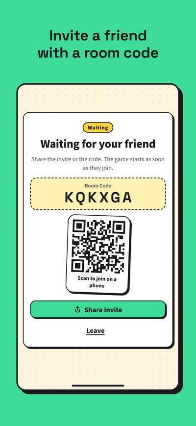
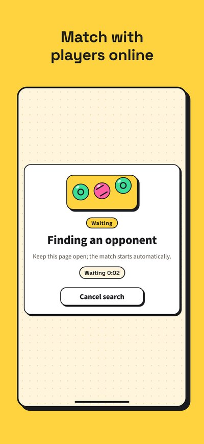
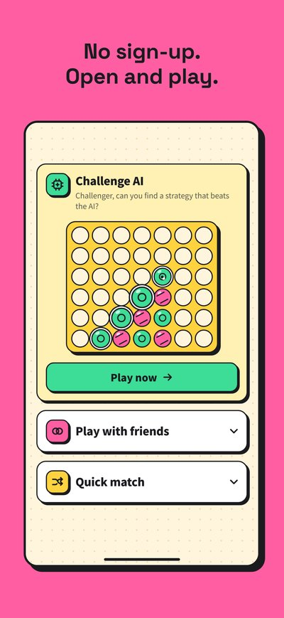
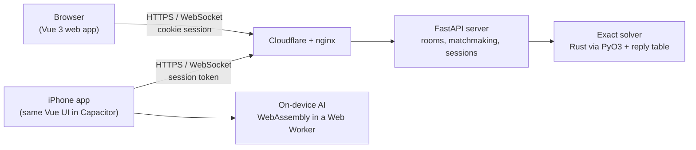

<p align="center">
  
</p>

<h1 align="center">Four In A Row: Super AI</h1>

<p align="center">
  Four-in-a-row against an AI that never makes a mistake, or against your friends online.<br>
  On the web and on iPhone, in English, 繁體中文 and ไทย.
</p>

<p align="center">
  <a href="https://connect4.oraclelee.com"></a>
  <a href="https://apps.apple.com/app/id6816204087"></a>
  <a href="LICENSE"></a>
</p>

<p align="center"><a href="#繁體中文">繁體中文說明在下方</a></p>

## Demo

- **Play now in any browser:** <https://connect4.oraclelee.com>. No sign-up; open the page and play.
- **iPhone:** [Four In A Row: Super AI on the App Store](https://apps.apple.com/app/id6816204087) (iOS 15 or later, free, no ads).

<p align="center">
  
</p>

<p align="center">
  
  
  
  
</p>

## Features

- **A Super AI that plays perfectly.** An exact solver scores every legal move to the end of the game and picks the best one, with a fixed centre-first tie-break. It has no depth limit, no random weakening and no heuristic fallback. A precomputed reply table answers the slowest positions instantly.
- **Play with friends.** Create a private room and share the room code, invite link or QR code. Friends can join from the app or any browser.
- **Quick match** pairs you with another player online.
- **The iPhone app works offline.** The same solver runs on the phone as WebAssembly, so AI games need no network, and an unfinished game resumes after the app is closed.
- **Three languages.** English, Traditional Chinese and Thai; the first launch follows the device language.
- **No account, no ads, no tracking.** See the [privacy policy](PRIVACY.md).

## How it works



- The server is authoritative for every online game: it checks each move and decides the result, so clients cannot cheat.
- The website and the app share one Vue code base. The app packages it with Capacitor and adds offline AI, saved progress and the system share sheet.
- Sessions and rooms live in the server's memory; there is no database. The wire protocol is documented in [docs/protocol.md](docs/protocol.md).

| Part | Technology |
| --- | --- |
| Frontend | Vue 3, TypeScript, Pinia, Vue I18n, Vite |
| Backend | Python 3.10+, FastAPI, Uvicorn, native WebSocket |
| AI | [connect-four-ai](https://github.com/benjaminrall/connect-four-ai) (Rust) through PyO3 on the server and as WebAssembly in the app |
| Mobile | Capacitor 8 (iOS; an Android build is produced in CI) |
| Delivery | Podman image on GHCR, systemd, nginx, Cloudflare |

## Quality checks

Every pull request runs on GitHub Actions and must pass before it can be merged:

- **backend:** Ruff lint and format, pytest, the Rust solver's tests, dependency audits (pip-audit, cargo audit), shellcheck and a dry run of the release script.
- **frontend:** Vitest unit tests, type-checked build, Prettier and about 60 Playwright scenarios on 10 screen sizes (six iPhones in WebKit, a Galaxy S26 Ultra in portrait and landscape, two desktops), with screenshot comparison against approved baselines.
- **container:** builds the production image, starts it and plays an AI move against it.
- **Mobile** (when app files change): iPhone simulator and Android emulator smoke tests, including offline play and first launch in each language.

## Run it locally

You need Python 3.10+, stable Rust and Node.js 22+.

```bash
python3 -m venv .venv
.venv/bin/python -m pip install -e '.[dev]'
npm --prefix frontend install

.venv/bin/uvicorn connect4_app.app:app --host 127.0.0.1 --port 55555 --reload
npm --prefix frontend run dev        # then open http://127.0.0.1:5173
```

More detail (in Traditional Chinese):

- [docs/development.md](docs/development.md): development workflow, tests and the mobile app
- [docs/deploy.md](docs/deploy.md): releases and production deployment
- [docs/mobile-release.md](docs/mobile-release.md): building, signing and publishing the app

## License

Copyright (c) 2024-2026 EdwardLeeee.

This project is **source-available, not open source**. It is licensed under the [PolyForm Noncommercial License 1.0.0](LICENSE):

- **Allowed:** reading the code, learning from it, running it and changing it for personal, educational, research or other noncommercial purposes.
- **Not allowed without permission:** any commercial use, such as selling it, publishing it as your own app, running it with ads or using it in a company's product or service.

For a commercial license, open an issue on this repository.

Third-party components keep their own licenses; see [THIRD_PARTY_NOTICES.md](THIRD_PARTY_NOTICES.md).

Connect 4 is a trademark of Hasbro. This project is an independent implementation of the traditional four-in-a-row game and is not affiliated with or endorsed by Hasbro.

---

## 繁體中文

**四子棋 Super AI**：跟一個永遠不會下錯的 AI 對戰，或在線上跟朋友對戰。網頁和 iPhone app 都能玩，支援繁體中文、英文和泰文。

### 馬上試玩

- **瀏覽器**：<https://connect4.oraclelee.com>，不用註冊，打開就能玩。
- **iPhone**：[App Store 上的「四子棋 Super AI」](https://apps.apple.com/app/id6816204087)，需要 iOS 15 以上，免費、沒有廣告。

### 特色

- **Super AI 下出完美的棋**：每一步都算到終局，選最好的一手；沒有深度限制，不會故意放水。最花時間的局面事先算好存成回應表，所以回得很快。
- **跟朋友玩**：建立私人房間，分享房號、邀請連結或 QR code；朋友用 app 或任何瀏覽器都能加入。
- **隨機配對**：跟線上的其他玩家對戰。
- **iPhone app 可以離線玩**：AI 直接在手機上算，沒有網路也能下；下到一半關掉 app，再開會接著下。
- **三種語言**：第一次打開時跟隨手機語言，之後可以在設定裡切換。
- **不用帳號、沒有廣告、不追蹤**：見[隱私權政策](PRIVACY.md)。

### 架構

網站和 app 共用同一套 Vue 程式。app 用 Capacitor 打包，另外加上離線 AI、保存進度和系統分享。線上對戰由 FastAPI 伺服器判定每一步和勝負；AI 是開源的 connect-four-ai，伺服器上透過 PyO3 呼叫，app 裡則編譯成 WebAssembly 在手機上執行。開發、測試與部署的細節見 [docs/development.md](docs/development.md) 和 [docs/deploy.md](docs/deploy.md)。

### 授權

本專案**公開原始碼，但不是開源軟體**，採用 [PolyForm Noncommercial License 1.0.0](LICENSE)：

- **可以**：閱讀、學習、自己執行、修改，用於個人、教育、研究等非商業目的。
- **未經同意不可以**：任何商業用途，例如販售、當成自己的 app 上架、放廣告營利，或用在公司的產品與服務。

需要商業授權，請在本 repo 開 issue 聯絡。

第三方元件依各自的授權使用，見 [THIRD_PARTY_NOTICES.md](THIRD_PARTY_NOTICES.md)。Connect 4 是 Hasbro 的商標；本專案是傳統四子棋遊戲的獨立實作，與 Hasbro 沒有任何關係，也未經其背書。
